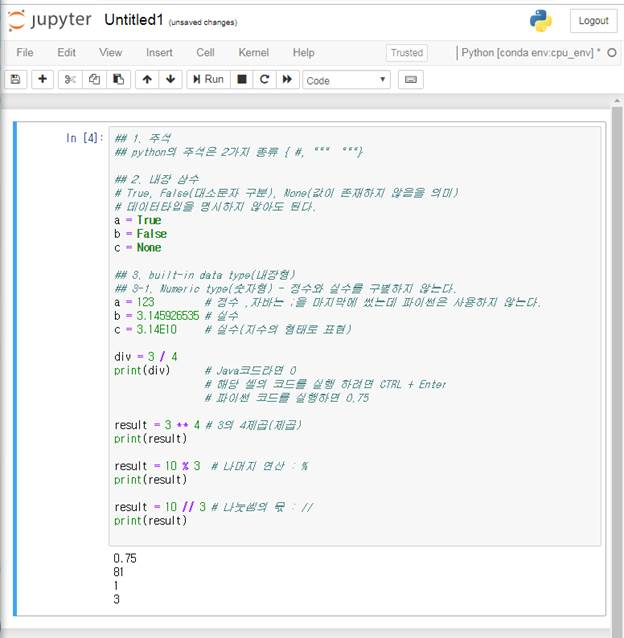
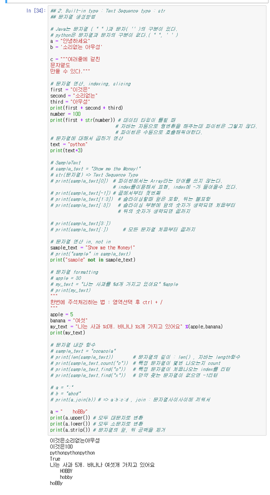

#### 2019 - 06 - 28 (3일차)

# 빅데이터 분석_Anaconda_Python

파이썬 = 데이터 처리 , 자료처리에 특화 

## 빅데이터 분석

- 개발환경설정

  python언어를 이용

  python 개발을 할 때 가장 일반적인 개발 툴 : 파이참(무거움)

  python 데이터 분석을 할 때 가장 일반적인 개발 툴 : 주피터 노트북

- 1단계 : python language spec. 

  => 프로그램 작성에 대한 연습문제

- 2단계 : python 데이터 분석 library 

  => numpy & pandas 사용방법 => 탐색적 데이터분석(eda)를 할수 있음

- 3단계 : machine learning ( tensorflow )

- 4단계 : deep learning ( tensorflow )

 

- python 부터 설치해야함

  => 그냥 개별적으로 설치하는 것 보다는 개발툴 + 인터프리터 + 각종 라이브러리가 합쳐져 있는 anaconda라는 걸 설치해서 사용

- Anaconda는 무료로 사용이 가능

  https://www.anaconda.com/distribution/ 설치 경로

  서비스에서 오라클부분 중지시키고 수동으로 변경 => 좀더 빠르게 사용하기 위해서

- 설치진행.. 현재 python 버전은 3.7

- 설치가 완료되면 anaconda Prompt를 관리자 권한으로 실행


- **pip** : 패키지 설치 도구 , 최신버전으로 업그레이드 해야한다.

  => python –m pip install --upgrade pip : 파이썬의 명령을 통해서 도움을 받아 pip버전 업그레이드, 외부프로그램을 설치

- 개발을 위해 가상환경을 생성 

  Tensorflow ( 구글에서 제공하는 라이브러리 )

  우리가 나중에 사용할 tensorflow를 이용할 건데 tensorflow는 현재 python 3.6버전 이전에서 동작한다.

  ​	=> **conda create –n cpu_env** ( 새로운 가상환경의 이름 **) python=3.6** ( 지정해서 쓰지 않으면 3.7으로 깔림) **openssl**     / y하고 엔터

- 현재 존재하는 가상환경의 리스트 출력

  => conda info –envs

- 생성된 가상환경으로 전환

  => activate cpu_env

- nb_conda 설치 (라이브러리)

  => conda install nb_conda  / y하고 엔터

- 개발환경 실행

  => jupyter notebook 

  내장 웹서버가 동작 => 크롬 브라우저가 실행이되서 개발환경이 동작

  => 만약 개발환경 ( Chrome IDE )에서 우리 가상환경이 안보일 경우 

  ​	=> python –m ipykernel install –user –name cpu_env –display-name=[CPU_ENV]


개발창이 뜸! 그곳에서 파이썬코드 작성하고 실행화면됨!

관리자 모드에서 **ctrl + c** 누르면 주피터 노트북 종료됨

- 마지막 환경설정 ( working directory 설정 )

  => jupyter notebook --generate-config , 파일이 어디에 생성됬는지 알려줌


​			c.NotebookApp.notebook_dir = 'C:/python_ML'


​			C드라이브에 python_ML 파일만들기 ( 해당폴더를 만들어주어야함 )

 

주피터 노트북 실행


새로운 가상환경 클릭해서 실행시킴


python에서 1줄 주석 => #

python에서 여러줄 주석 => """  """   

1. DATA : 측정이나 관찰을 통해서 모아 놓은 값의 집합

​     사실을 표현하는 하나의 단면일 뿐 그 자체가

​     의미를 가지지는 않는다.


2. 이런 데이터를 기반을 의미있는 내용(사실)을

  끌어내는 작업 => Data Analysis(데이터분석)


3. Big Data의 일반적인 의미

   => 기존의 관리체계, 분석체계로 감당할 수 없는 많은

  양의 데이터를 의미


4. Big Data의 3가지 특징(3V)

   - 데이터의 규모(Volum)

     ​    GB->TB(테라)->PB(페타)->EB->ZB->YB

   - 데이터의 다양성(Variety)

     ​    비정형화된 형태의 데이터로 구성

   - 데이터의 발생속도(Velocity)

     ​    데이터가 실시간적으로 발생된다는 특징 
     
     

5. Big Data의 분석방법
   
   - EDA(Exploratory Data Analysis) : 탐색적 데이터 분석
- 통계적 가설 검정
   - 머신러닝 - 많은 양의 데이터를 기반으로 프로그램을 학습시켜서 분석

   

6. 왜 python 인가?
   - 데이터분석에 최적화되어있다.
   - 상대적으로 배우기가 쉽다.
   - 인터렉티브한 개발이 용이
   - 아주아주 강력한 무료의 라이브러리(Numpy, Pandas)
   - 단점) 2.x 버전과 3.x 버전의 호환성이 없다.

   
   
7. 가장 많이 사용되는 언어
     주력으로 사용하는 언어 하나는 반드시 있어야 한다.
   1. Java
   2. C
   3. python
   4. C++
   5. JavaScript
   6. Net


## 새로운 가상환경 생성

```python
## 1. 주석
## python의 주석은 2가지 종류 { #, """ """}

## 2. 내장 상수
# True, False(대소문자 구분), None(값이 존재하지 않음을 의미)
# 데이터타입을 명시하지 않아도 된다.

a = True 
b = False
c = None

## 3. built-in data type(내장형)
## 3-1. Numeric type(숫자형) - 정수와 실수를 구별하지 않는다.
a = 123			# 정수 ,자바는 ;을 마지막에 썼는데 파이썬은 사용하지 않는다.
b = 3.145926535 # 실수
c = 3.14E10   	# 실수(지수의 형태로 표현)

div = 3 / 4
print(div)   	# Java코드라면 0
				# 해당 셀의 코드를 실행 하려면 CRRL + Enter
				# 파이썬 코드를 실행하면 0.75

result = 3 ** 4 # 3의 4제곱(제곱)
print(result)

result = 10 % 3 # 나머지 연산 : %
print(result)


result = 10 // 3 # 나눗셈의 몫 : //
print(result)
```



b ( below ) : 누르면 새로운 셀(cell)이 생성된다

dd : 하나의 셀(cell)이 삭제된다

주피터 노트북 단축키 정리 - [참고사이트](https://dbrang.tistory.com/1174)


```python
## 2. Built-in type : Text Sequence type : str
## 문자열 생성방법

# Java는 문자열 ( " " )과 문자( '' )의 구분이 있다.
# python은 문자열과 문자의 구분이 없다.( " ", ' ' )
a = "안녕하세요"
b = '소리없는 아우성'
c = """여러줄에 걸친
문자열도
만들 수 있다."""

# 문자열 연산, indexing, slicing
first = "이것은"
second = "소리없는"
third = "아우성"
print(first + second + third)
number = 100
print(first + str(number)) 	# 데이터 타입이 틀릴 때 
							# 자바는 자동으로 형변환을 해주는데 파이썬은 그렇지 않다.
							# 파이썬은 수동으로 호출해줘야한다.

# 문자열에 대해서 곱하기 연산
text = "python"
print(text*3)

# SampleText
# sample_text = "Show me the Money!"
# str(문자열) => Text Sequence Type
# print(sample_text[0]) 	# 파이썬에서는 Array라는 단어를 쓰지 않는다. 
							# index를이용해서 표현, index에 -가 들어올수 있다. 
# print(sample_text[-1]) 	# 끝에서부터 첫번째
# print(sample_text[1:3])	# 슬라이싱할때 앞은 포함, 뒤는 불포함
# print(sample_text[:3])  	# 슬라이싱 부분에 앞의 숫자가 생략되면 처음부터 
							# 뒤의 숫자가 생략되면 끝까지
# print(sample_text[3:]) 
# print(sample_text[:])   # 모든 문자열 처음부터 끝까지

# 문자열 연산 in, not in
sample_text = "Show me the Money!"
# print("sample" in sample_text) 
print("sample" not in sample_text) 

# 문자열 formatting
# apple = 30
# my_text = "나는 사과를 %d개 가지고 있어요" %apple
# print(my_text)

"""
한번에 주석처리하는 법 : 영역선택 후 ctrl + / 
"""
apple = 5
banana = "여섯"
my_text = "나는 사과 %d개. 바나나 %s개 가지고 있어요" %(apple,banana) 
print(my_text)

 
# 문자열 내장 함수
# sample_text = "cocacola"
# print(len(sample_text))    	# 문자열의 길이 : len() , 자바는 length함수
# print(sample_text.count("c")) # 특정 문자열이 몇번 나오는지 count
# print(sample_text.find("o"))  # 특정 문자열이 처음나오는 index를 리턴 
# print(sample_text.find("x"))  # 만약 찾는 문자열이 없으면 -1리턴

# a = ":"
# b = "abcd"
# print(a.join(b)) # => a​ : b : ​c : d , join : 문자열사이사이에 끼워서 

a = "  hoBBy"
print(a.upper()) # 모두 대문자로 변환
print(a.lower()) # 모두 소문자로 변환
print(a.strip()) # 문자열의 앞, 뒤 공백을 제거
```


