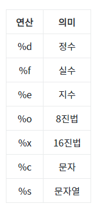

#### 2019 - 07 - 01 (4일차)

# 빅데이터 분석_ Anaconda_Python 

jupyter notebook 실행!!


## 복습

```python
# 한줄 줄석은 # 기호를 이용해서 표현
# 여러 줄 주석은 ‘’’ ’’’ (“”” ”””)

# 2. 기억해야 하는 내장 상수
# True : False가 존재 함 (대소문자 구분)
# None : 값이 존재 하지 않아 라는 의미의 상수 

# 3, Built-in type (내장형)
# 3-1. Number type (숫자형)
a = 123
a = 3.1415192
a = 3.14E10
a = 0xEE # (16진수)
a = 0o55 # (8진수)

a = 3 / 4 # 결과가 0.75로 실수가 나온다. 파이썬 버전 2.x 와 3.x 는 호환이 되지않는다.
# 몫을 구할 때는 “//” , 나머지를 구할 때는 “%”

# 3-2. Text Sequence Type (str)

# 기본적인 문자열 표현
# 문자열 연결
print("이것은" + "소리없는") 
print("이것은" * 3)

# 문자열의 indexing, slicing
# indexing : 배열을 생각하면 된당.
a = "show me the money"
print(a[0])   # indexing
print(a[-1])  # index의 값이 음수면 뒤에서부터 위치 계산
print(a[2:4]) # slicing. 앞에 불포함 뒤에 포함
print(a[:])   #  숫자를 비워두게 되면 a 전체를 복사

# in 연산자 - 논리연산
a = "Hello"
print("e" not in a)

# 문자열 포매팅은 상당히 여러 방법이 있다.
sample = "나는 사과를 %d개 가지고 있어요!" %10 
print(sample)
sample = "나는 사과를 {}개 가지고 있어요!" .format("다섯") # 중괄호 {}를 이용 - 어떤형식의 매핑도 가능함 , 
                                                           # {}안에 원래 숫자를 넣어주어야한다. 0은 의미 없으니까 생략
print(sample)
sample = "나는 사과를 {0}개, 바나나 {1}개 가지고 있어요!" .format("다섯",10) # 제일 많이 사용되는 방법
print(sample)

# 많이 사용되는 문자열 함수에 대해서도 기억해야 한다.
sample = "sampleText" 
print(len(sample)) # len()함수 파이썬이 가지고 있는 내장함수 - 글 사이즈 , 자바처럼 sample.len()식으로 쓰면 안된다!!
```


## Python type

### list

```python
# Python Sequence Type : list
# 파이썬에서는 array가 없다 , 
# Java에서 Arraylist와 상당히 유사

# list 생성 - list함수를 이용해서
a = list()   # 공백 리스트를 생성.
a = []       # 공백 리스트를 생성.
a = [1,2,3]  # 일반적인 리스트 생성.
a = [1,2,3,"안녕하세요",3.141592,False] # 여러 타입을 사용 가능
a = [1,2,[3,4,5],6,7]

# indexing 과 slicing list에서 사용 가능. (문자열 사용과 유사)
print(a[0])
print(a[-2])  
print(a[1:3])

# list의 연산
a = [1,2,3]
b = [4,5,6]
print(a + b) # list에서 + 는 list와 list를 연결시켜서 하나의 긴 list를 만들어줌
print(a * 3)

a =  [1,2,3]
a[0] = 5
print(a)

a[0] = [9,9,9]
print(a)

a[0:1] = [9,9,9]
print(a)

a = [1,2,3,4,5,6,7]
# 위의 list를 [1,2,6,7]로 변형 하려면?
a[2:5] = []
print(a)

""" 자동완성 => tab누르면됨!! """

# 리스트의 사용 함수
my_list = [1,2,3]
print(my_list)

my_list.append(4) # 맨 마지막 인덱스에 값을 추가
print(my_list)

# my_list.append([5,6,7])
# print(my_list)

my_list.extend([5,6,7])
print(my_list)
# append 와 extend 는 완전히 틀린거임 / 자주사용되는 함수

# 입력했을 떄 녹색이 나오면 예약어 , 에약어를 변수로 만들면 안된다.
my_list = [7,3,1,8,2]
my_list.sort() # 기본으로 오름차순으로 정렬된다.하지만 결과를 리턴하지 않고 원본을 제어함.
print(my_list)

my_list.reverse() # 내림차순으로 정렬. 리스트를 역으로 만드는 거 
print(my_list)

my_list = [7,3,1,8,2]
print(my_list.index(1)) # index() 함수는 찾는 값의 위치를 리턴해준다.
```

까먹지말자아아~~ 셀만드는 거 b키 누르면 됨!!!

### Tuple

```python
# Python Sequence Type : Tuple    
# list와 상당히 유사.
# 표현방법이 다르다,!! 원본을 수정, 삭제가 불가능.(list와 차이점)
# list의 표현방법 :  []대괄호, tuple의 표현방법 : ()소괄호
a = ()
a = (1,2,3)   # [1,2,3]
a = (1,)      #[1]
              # 요소가 1개 있을 때 tuple을 표현하려면 콤마를 사용하면 된다.
              # a = (1,)
a = (1,2,3,4) # tuple
              # tuple은 ()을 생략할 수 있다.
a = 1,2,3,4

a,b,c = 10,20,30
print(a)

# indexing과 slicing 둘 다 사용 할 수 있다.
a = (1,2,3,4)
print(a[1])    # 2출력
print(a[2:4])  # (3,4)출력

# 리스트와 마찬가지로 +, * 연산이 가능
a = (1,2,3)
b = (5,6,7)
print(a + b)
print(a * 3)

# list 와 tuple간의 변환
my_list = [1,2,3]
my_tuple = tuple(my_list)
print(my_tuple)

my_tuple = 10,20,30,40
my_list = list(my_tuple)
print(my_list)
```

### range

```python
# Python Sequence Type :  range
# range는 숫자 sequence로 주로 for문에서 사용

# range의 인자가 1개이면 0부터 시작, 1씩 증가
my_range = range(10) # 앞 : 포함 안됨 시작 , 뒤 : 끝 포함
print(my_range)

# range의 인자가 3개이면 시작,끝 증감을 의미
my_range = range(10,20,3) 
print(12 in my_range)

# range도 list나 tuple처럼 indexing 과 slicing 이 가능함
my_range = range(10,20,3) 
print(my_range[-1])
print(my_range[:2]) # 처음부터 0.1

# range를 이용한 for문 - 자바처럼 작성하지 않는다. 파이썬은 중괄호를 쓰지 않는다
"""
for(i=0;i<10;i++)
    print("Hi")  # 자바형식
"""    
for tmp in range(10,20,2):
    print(tmp) # 인덴트 처리 중요!
```

### dict

```python
# Python mapping Type :  dict  - hashMap생각하면됨!

# 표현법은 JSON표현과 유사 {key : value} 
# { "name" : "홍길동", "age" : 30 }
my_dict = { "name" : "홍길동", "age" : 30 }
print(type(my_dict))

# 새로운 key:value를 추가할 경우 
my_dict[100] = "홍길동"
print(my_dict)

# 특정 key를 삭제 할 경우
del my_dict["age"]
print(my_dict)

# key값이 중복되는 경우
my_dict = {"name" : "홍길동", "age" : 30, "age" : 40}
print(my_dict)

# keys() : dict의 key값들만 뽑아낸다.  키값의 집합
my_dict = {"name" : "홍길동", "age" : 30, "address" : "서울" }
print(my_dict.keys())
# 리턴값은 key값들의 리스트처럼 생긴 객체.
# list와 유사하지만 list의 함수는 사용할 수 없다.

# values() : dict의 value값들만 뽑아낸다.  값들의 집합
# items() : (key,value)의 형태로 구성된 리스트처럼 생긴 객체를 리턴.

my_dict = {"name" : "홍길동", "age" : 30, "address" : "서울" }
# for문을 이용하여 모든 key와 그에 대한 value값을 출력
# for ~~~~~ in ~~~~: 구문을 이용해서
for key in my_dict.keys():
    print("{0}. {1}".format(key, my_dict[key]))
```

### set

```python
# Python set Type :  set   내장형타입
# set의 가장 큰 특징 : 중복을 허용하지 않는 저장장소,
#                      순서가 없는 저장구조,

my_set = set([1,2,3]) # set 생성 => {1,2,3}
print(my_set)

my_set = set("Hello") # {"H", "e", "l", "o"}  ㅣ은 중복허용안하기 떄문에 한개만
print(my_set)

# 기본적인 set 연산(교집합, 합집합, 차집합)
s1 = {1, 2, 3, 4, 5}
s2 = {4, 5, 6, 7, 8}

print(s1 & s2)  # 교집합(intersection)
print(s1 | s2)  # 합집합(union)
print(s1 - s2)  # 차집합(differences)

# 기타 사용가능한 method
my_set = {1, 2, 3, 4, 5}

# set에 새로운 요소를 추가하려면 : add
my_set.add(10)
print(my_set)

# set에 여러개를 추가하려면 : update
my_set.update([7,8,9])
print(my_set)

# set에서 삭제할 경우 : remove                                 
my_set.remove(1)
print(my_set)
```

### bool

```python
# Python Data Type :  bool 
# 논리 상수인 True, False 를 사용
# 다음과 같은 경우는 False로 간주
# 1. 빈 문자열은 논리연산시 False("")
# 2. 빈 리스트([]), 빈 튜플(()), 빈 딕셔너리({})
# 3. 숫자 0 False 간주, 나머지 다른 숫자 True 간주
# 4. None => False 간주

# Python의 console 입출력
input_value = input("숫자를 입력하세요!")
# 입력받은 값은 무조건 문자열.
# eval() : 문자열을 숫자연산처리, 문자열을 연산할 수 있다.

result = eval(input_value) * 3
print(result)

area = ["seoul", "suwon", "pusan"] # list

# if문 
if "suwon111" in area:
    # 수행할 코드를 여기에 작성
    pass # 이 조건에 대해서 할일이 없을 때 사용
elif "pusan" in area:   #else if = elif
    print("부산")
else:
    print("마지막입니다.!")
```


## 정리

### Str (문자열)

- 따옴표를 이용하여 문자열 생성가능

- 생성 : 작은따옴표( ‘ ’ )를 사용하거나 큰따옴표( “ ” ) 사용

- 연산 : + 문자열끼리 합칠 수 있음

  ​		   \* 문자열을 반복할 수 있음

- 문자열[index] index에 위치한 문자를 출력

- 문자열[start:end] start부터 end까지의 문자열 출력

- 문자열[start : end : ​step] ] start부터 end까지 step간격의 문자열을 출력

- 포맷 : %포맷형식 , %(변수 또는 값)



- 변환 : 문자열.upper() 소문자를 대문자로 변경

  ​		  문자열.lower() 대문자를 소문자로 변경

  ​		  문자열.split() 띄어쓰기 마다 분리해 리스트로 변환

  ​		  문자열.join() 문자열 사이사이에 문자열 삽입

### List

- 파이썬에서 리스트를 이용하여 다양한 연산이 가능

- 데이터 형식과는 무관하게 저장가능

- list안에 다른 list를 포함시킬 수 있음

- ( [ ] ) 대괄호를 사용, 순서 중요

- 연산 시 원소에 대한 값이 아닌 리스트 자체에 대한 연산 실시

- 생성 : 리스트는 대괄호( [ ] )와 콤마( , )를 이용하여 생성

- 이어 붙이기 : + 를 이용하여 리스트끼리 합치거나 새로운 값을 추가

- 반복 : * 을 이용하여 리스트를 반복시켜 리스트의 크기가 커짐

- 참조 : 리스트는 :을 이용하여 리스트를 참조

  ​      	 리스트[index]를 사용하면 index의 값 출력

​            	  리스트[start : end]를 사용하면 start부터 end값 까지 출력

​            	  리스트[start : end : ​interval]를 사용하면 start부터 end값 까지 interval 간격만큼 출력

- 포함 : 리스트안에 리스트를 포함한 리스트 생성 가능

- 조사 : len() 리스트의 길이

     	   min() 리스트에서 최소값을 가지는 원소의 값

  ​		  max() 리스트에서 최대값을 가지는 원소의 값

  ​		  리스트.index() 해당값이 가지는 위치확인

  ​		  리스트.count() 해당값이 가지는 개수확인

  ​		  값 in 리스트 해당값이 존재하는지 확인

- 삽입 : 리스트.insert(index, value) index의 바로 앞자리에 value를 삽입

  ​		  리스트.append(value) 리스트의 마지막 자리에 value를 삽입

​         		리스트.extend(list) 리스트의 마지막자리에 list의 원소들을 삽입

- 삭제 : del 리스트[start, end] start부터 end-1까지의 원소를 삭제

​         		리스트.remove(value) value와 동일한 값을 지니는 원소 하나 삭제

- 정렬 : 리스트.sort() 리스트를 오름차순으로 정렬

​          		리스트.reverse() 리스트를 역순으로 정렬

### Tuple

- 소괄호( ( ) )를 이용하여 튜플 생성

- 정의에 사용되며 수정이 불가 순서 중요

- 생성 : 소괄호( ( ) )를 이용하여 리스트와 동일한방법으로 튜플 생성

- 참조 : 튜플은 :을 이용하여 참조가능

  ​		  튜플[index] index의 값을 출력

  ​		  튜플[start:end] start부터 end값 까지 출력

  ​		  튜플[start : end : ​interval] start부터 end값 까지 interval 간격만큼 출력

- 조사 : len() 튜플의 길이

  ​		  min() 튜플에서 최소값을 가지는 원소의 값

  ​		  max() 튜플에서 최대값을 가지는 원소의 값

  ​		  튜플.index() 해당값이 가지는 위치확인

  ​		  튜플.count() 해당값이 가지는 개수확인

  ​		  값 in 튜플 해당값이 존재하는지 확인

### Range

​      

### Dictionary

- 중괄호( { } )를 이용하여 생성 , key와 value로 구성 JSON형식과 유사
- Key를 호출해 value를 불러옴, key는 중복 불가능 value는 중복가능 순서 무관
- 병합 : 사전.update(사전) 다른 사전 병합

### Set

- 중괄호( { } )를 이용하여 집합 생성

- 집합은 연산에 사용되며 중복이 불가능하고 순서 무관

- 추가 : 집합.add() 값을 가지는 원소를 추가 할 수 있다.

- print(s1 & s2) # 교집합(intersection)

- print(s1 | s2) # 합집합(union)

- print(s1 - s2) # 차집합(differences)