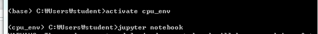

#### 2019 - 07 - 02 (5일차)

# 빅데이터 분석_ Anaconda_Python 

jupyter notebook 실행!!




## 날짜 알아보기

```python
# python data type - 날짜(date, time, datetime)
from datetime import date, time, datetime

# 현재 날짜 알아보기
today = date.today()
print("오늘의 날짜 : " + str(today))

print("연도 : {0}, 월 : {1}, 일 : {2}".format(today.year, today.month, today.day)) 

today = datetime.today()
print(today) # 자바의 util.date 생각하면됨
Print
# 기억해야될 모듈 2가지정도
## 날짜 연산 date는 날짜만 datetime은 날짜랑 시간 둘다 구함

from datetime import date, time, datetime, timedelta
from dateutil.relativedelta import relativedelta
     # 패키지      
         
# 오늘의 날짜 구하기
today = date.today()
# 날짜 간격
# days = timedelta(days=-100) # 음수 : 전날 ,양수 : 다음날

# days = timedelta(months=-2) # 두달전 , 년(year)과 월(month)은 안된다,=> 오휴남, 다른 모듈이용해야함 일, 시간, 분, 초만 해당함
days = relativedelta(months=-2) # 년, 월은 relativedelta 사용해야함
print(today + days)

# 오늘날짜와 현재시간 구하기
today = datetime.today()
delta = timedelta(hours=-3)
print(today + delta)
```


## print

```python
## print 문 사용
for tmp in range(10) : # 자바 for each 형태
    print("tmp : {}".format(tmp), end =" ") # + 기호 덜쓰고 .format 사용하기
    
# print 함수는 기본적으로 출력한다음 한줄을 넘어간다.
# print 함수의 마지막 인자로 출력에 대한 제어를 할수 있다. : ,end
```


## for 문

```python
## for 구문
my_list = [1,2,3,4,5]
my_sum = 0

# for tmp in my_list: # 들여쓰기를 통해 {} 역할을함
#     my_sum += tmp

for tmp in range(len(my_list)):
    my_sum += my_list[tmp]
    
print("합계 : {}".format(my_sum))

my_list = [1,2,3,4,5]
new_list = [tmp * 2 for tmp in my_list] # 리스트를 만들때 리스트안에 for문이 들어갈 수 있다.
print(new_list)

my_list = [1,2,3,4,5]
new_list = [tmp * 2 for tmp in my_list if tmp % 2 == 0] 
print(new_list)
```


## 자료구조, 함수

```python
## python의 기본 자료구조(자료형)
# python의 제어문(if, for) swith문은 없다.
# 함수- 단위코드의 집합 / 메서드- 인스턴스가 가지고 있는 
# 함수

# python의 함수는 2가지 종류가 있다.
# 1. 사용자 정의 함수
# 2. 내장 함수

# 내장 함수의 종류
# len() : 개수를 알려준다.
# abs() : 숫자에 대한 절대값을 알려준다.

# all() : 반복가능한 자료형에 대해서 모두가 참이면 True
my_list = [1,2,True,"Hello",0]
print(all(my_list))
# any() : 반복가능ㅎ한 자료형에 대해서 단 한개라도 참이면 True
print(any(my_list))
# eval() : 실행가능한 문자열을 입력받아서 수치연산을 수행
print(eval("3+4*2"))
# int() : 정수로 변환, list() : 리스트로 변환
# tuple() : tuple로 변환, str() : 문자열로 변환

my_list = [1,2,3,4,5]
for idx,item in enumerate(my_list): #  튜플 (idx,tmp) ()생략가능
    print("idx : {0}, item : {1}".format(idx,item))
    
# 정렬에 대한 내장함수
my_list = [7,3,9,2,8,5]  # 정렬이 안된 리스트를 준비
result = sorted(my_list) # 정렬된 결과가 리턴되고 원본객체는 변환이 되지 않는다.
print(result)

# 정렬에 대한 method 
my_list = [7,3,9,2,8,5] # 정렬이 안된 리스트를 준비
my_list.sort()          # instance의 method를 호출 - 해당 인스턴스에 영향 , 자바에서는 필드 파이썬에서는 property
                        # instance를 제어하고 return : None
print(my_list)
    
# 사용자 정의 함수를 만들어 보아요~ def = define 정의하다
def  my_sum(a,b,c):
    return a+b+c

result = my_sum(10,20,30)
print(result)

# 만약에 인자의 개수를 알지 못하는 경우라면?  / * : 인자의 개수 상관없이 해당함수 이름만 맞으면 호출
# 입력인자를 tuple의 형태로 받는다.
def my_sum_1(*args):
    result = 0
    for tmp in args:
        result += tmp
    return result

result = my_sum_1(10,20,30,40,50)
print(result)

# 파이썬은 함수의 리턴값이 2개 이상일 수 있어요.(X) 실제로는 그렇지 않다. - 튜플때문에 그렇게 보이는 것임
def my_func(a,b):
    result1 = a+b
    result2 = a*b
    return result1, result2 # (result1, result2) ()생략, 튜플을 리턴하는 것임

res1, res2 = my_func(10,20)
print(res1, res2)

## 사용자 정의 함수 : scope
# 전역변수(global variable)와 지역변수(local variable)

tmp = 100 # 전역변수

def my_func(x):
    # tmp # 지역변수 - 초기화를 해줘야지 사용가능, 오류가 발생하지 않는다.
    global tmp # 전역변수를 지칭
    tmp += x
    return tmp

print(my_func(3))
```


## Python 객체지향

```python
## Python의 객체지향
## class 정의하고 사용해 보기!

# class 
# 1. 현실세계의 개체를 프로그래밍적으로 모델링하기 위해서 사용하는 수단
# =>  객체모델링의 수단
# 2. 새로운 데이터 타입을 만드는 수단

 # {}대신에 indent사용
class Student: 
    # property(field)
    s_nation = "국적"  # 자바에서 class variable : static
                       # 클래스 안에서 공유
        
    # Constructor(생성자) - 함수형태로 이름정해져있음 __init__
    def __init__(self,n,nation): # self : 자바에서 this 의 의미
        Student.s_nation = nation # class variable
        self.s_name = n           # instance variable
    
    # method
    def display(self):
        print("국적 : {0}, 이름 : {1}".format(self.s_nation, self.s_name))
        
# instance 생성
stu1 = Student("홍길동","한국")
stu1.display()
```


## 절차적 프로그래밍 vs 객체지향 프로그래밍

### **절차적 프로그래밍**

- 대표적인 언어 : C

- 절차적 언어의 프로그래밍 방식

- 프로그램을 기능으로 분할해서 하위 기능부터 구현하고 전체 기능을 통합해서 구현

  Ex) 은행프로그램을 구현해 보아용!~ (세분화가 안될 때 까지 세분화시킴)

  \-    은행의 기능을 판별

  ​	\-    예금업무

  ​		\-    입금업무

  ​			\-    자행입금

  ​			\-    타행입금

  ​			\-    무통장입금

  ​			\-    인터넷뱅킹입금

  ​	\-    출급업무

  \-    대출업무

  \-    외환업무

  \-    보험업무

  \-    기타등등등…

- 장점 : 프로그램 분석,기획,설계가 쉽다. 누가 하느냐에 따라 상관없다.

  ​      	프로그램의 설계가 쉽고 프로그램을 빨리 빌딩할 수 있다.

- 단점 : 1990년 중반 => 인터넷 도입 => 정보량이 증가 

  ​      => 유지보수에 대한 요구사항이 지속적으로 발생

  ​     	  유지보수 비용 > 개발비용

  ​     	  프로그램의 페러다임이 변화

  ​     	  절차적 언어를 이용한 프로그램에서 객체지향 프로그램으로 변경

  

### **객체지향프로그래밍**

★유지보수★

- 대표적인 언어 : Java 

- 장점 : 유지보수에 탁월 ( 재사용성 )

- 단점 : 설계가 어렵고 구현에 시간이 오래걸림

- 객체지향 프로그래밍은 어떻게 프로그래밍을 하는 걸까요?

- 현실세계의 구현해야 하는 문제를 그대로 프로그램으로 모델링 하려는 방식

- 현실세계의 여러 구성요소(개체)를 프로그램적으로 묘사하기 위해 class라는 개념을 도입

  => 행동( method ), 특징( field ) 


## Module

```python
## python - Module
## Module : 함수, 변수, class를 모아놓은 파일
## 다른 python 프로그램에서 불러와 사용할 수 있도록 만들어진 python 파일을 지침
## Module을 만들면 모듈을 불러다가 사용해야 한다.
## 이때 사용하는 keyword는 import

# import my_module 
# print(my_module.my_sum(10,20))

# import my_module as m1   # as :  별명을 줄수 있음
# print(m1.my_sum(10,20))

# from my_module import my_sum
# print(my_sum(10,20))

# 패키지 - 폴더를 만들어서 그안에 모듈을 관리,보관

import my_package.my_module
print(my_package.my_module.my_sum(10,20))

from my_package import my_module
print(my_module.my_sum(10,20))
```

