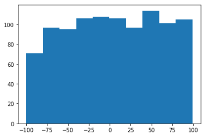

#### 2019 - 07 - 03 (6일차)

# 빅데이터 분석_ Anaconda_Python 

jupyter notebook 실행!!


## Numpy

새로운 프롬프트창 관리자권한으로 열어서

1. Numpy를 사용하기 위해 numpy module을 시스템에 설치

   => conda install numpy ( pip install numpy ) –anaconda가 깔려있어서 conda 사용해서 설치

   ​	  y입력 , 설치완료되면 exit 하고 종료

2. chart 그려주는 모듈 설치

   => conda install matplotlib 설치

기본적으로 같은 데이터 타입을 갖는다.


```python
## Numpy - 외부에서 해당 라이브러리를 다운받아야지 사용가능하다.
## Numeric Python 
## 1차원배열( Vector ), 2,3차원배열( Matrix )연산에 상당한 편의성을 제공 
"""
데이터베이스 => 2차원형태의 Matrix
"""
## Numpy는 그 자체로 의미가 있다기 보다는 다른 module의 기본 자료구조로 이용
## pandas외 matplotlib의 기본 자료구조로 이용

## Numpy의 자료구조 
## => 대부분 2차원이상의 다차원배열(n-dimensional array)이용 => ndarray
## ndarray는 python의 list와 상당히 유사
## 주요 차이점 : ndarrays는 같은 데이터 타입을 사용 ,list는 다른타입 사용가능
## list보다는 메모리 사용이나 속도면에서 상당히 좋다!! 
```

`import numpy as np` 를 사용해서 라이브러리를 사용할수 있음.


```python
# nbarray와 list 비교

#import 구문의 위치는 중요X => 하지만 최상단에 자바처럼관리하는게 편리함

import numpy as np  # 공통적으로 numpy의 약어는 np를 많이사용

#list를 만들어 보아용~!
my_list = [1,2,3,4]
print(my_list)
print(type(my_list))  #데이터 타입 확인 : type() 내장함수 사용
print(my_list[0])
print(type(my_list[0]))

# numpy array(ndarray)를 만들어 보아용! 
my_arr = np.array([1,2,3,4]) # () 안에는 파이썬의 리스트나 튜플이 들어감
print(my_arr)  #  vector,1차원배열로 출력
print(type(my_arr)) 
print(my_arr[0])
print(type(my_arr[0]))
print(my_arr.dtype)  # dtype 속성 : 배열안에서 데이터타입이 무엇인지 알수 있음 

"""
주요 차이 :  데이터 타입이 다름 / 수치연산을 할때는 데이터타입 조심!
"""

# 두번째 numpy array(ndarray)를 만들어 보아용! 
my_arr = np.array([100, 3.14, "Hello", True]) # 같은데이터타입으로 맞춰줘야함
                                              # str(문자열) 로 맞워서 
print(my_arr)
print(my_arr.dtype)  # <U32 , 유니코드출력
```

실행결과


```python
import numpy as np # 위 cell에서 입력해서 입력안해도 상관없음
my_list = [[1,2,3],[4,5,6]] # 2차원형태의 리스트
# nbarray 생성 시 데이터 타입을 명시해서 생성할 수 있다.
arr = np.array(my_list,dtype=np.float64) # 데이터타입 => numpy가 가지고 있는 형태로
print(my_list)
print(arr)
# matrix를 access함
print(my_list[1][1])
print(arr[1,1])
```

실행결과


```python
import numpy as np

my_list = [1,2,3,4]
arr = np.array(my_list) # 1차원의 numpy array가 생성 - vector
print(arr.ndim) # numpy가 몇차원의 데이터인지 알려줌
print(arr.shape) # numpy array의 형태를 tuple로 표현 / (4,) : 인자가 하나있는 배열 - 1차원배열
print(arr.size) # numpy array안의 요소 개수 , 차원상관없이

my_list = [[1,2],[3,4],[5,6]]
arr = np.array(my_list) # 2차원형태의 numpy array가 생성- matrix
print(arr)
print(arr.ndim)  # numpy array의 차원을 알려줌
print(arr.shape) # numpy array의 형태를 tuple로 표현
print(arr.size) # numpy array안의 요소 개수 	
print(len(arr)) # size와 비교해서 알아두기! 

"""
가장 많이 사용되는거 : shape - 알아낼때 많이사용
3차원배열 :행,열,깊이 4차원배열: 행,열,깊이,차원
"""
```

실행결과


```python
import numpy as np

my_list = [[1,2,3],[4,5,6],[7,8,9],[10,11,12]]
arr = np.array(my_list)
print(arr)
print(arr.shape) # (4, 3)

arr.shape = (12, ) # tuple표현 1차원배열로
print(arr)

arr.shape = (2,2,3) # tuple표현 3차원배열로
print(arr)
```

실행결과


```python
import numpy as np

my_list = [[1,2,3],[4,5,6],[7,8,9],[10,11,12]]
arr = np.array(my_list)

print(arr)

# for문을 적절히 이용해서 numpy array안의 데이터를 행렬형태로 출력하세요
# 1  2  3
# 4  5  6 
# 7  8  9
# 10 11 12

for i in range(arr.shape[0]):
    print()
    for j in range(arr.shape[1]):
        print(arr[i,j], end=" ")
```

실행결과


```python
import numpy as np

arr = np.array([1.2,3.4,5.5,7.9,10.3])
print(arr.dtype) # 정수 : int32, 실수 : float64
print(arr)

# numpy array dtype를 변환할 때 사용 : astype()
my_arr = arr.astype(np.int32) # 반올림을 하지않고 버림함.
print(my_arr)
```

실행결과


```python
# numpy array를 다양한 방식으로 만들어 보아요!
import numpy as np

arr = np.array([1,2,3,4,5]) # 일반적인 생성방법
print(arr)

# zeros() : 0으로 채우는 거
arr = np.zeros((3,4)) # shape를 알려줘야 한다. shape은 tuple로 표현
print(arr)

# ones() : 1로 채우는 거
arr = np.ones((3,4)) # shape를 알려줘야 한다. shape은 tuple로 표현
print(arr)

# empty() : 초기값은 주지 않고 생성하는데 garbage값이 들어간다.
arr = np.empty((5,3)) # shape를 알려줘야 한다. shape은 tuple로 표현
print(arr)

# full() : 값을 주면 그 값을 채우는거 / full(행,열),값 형식으로
arr = np.full((3,4),9,dtype=np.float64) # shape를 알려줘야 한다. shape은 tuple로 표현
print(arr)
```

실행결과


```python
import numpy as np

# 내가 정한 영역안에 내가 원하는 간격으로 numpy생성가능 - 파이썬의 range 생각하면됨!

# arange의 인자로 (0,10,2)를  사용했는데
# 0은 포함, 10은 포함하지 않고 간격은 2
arr = np.arange(0,10,2)
print(arr)

arr = np.arange(10)
print(arr)

# 실수형태
arr = np.arange(1.3,7.2) # 간격 생략 : 1임
print(arr)
```

실행결과


```python
import numpy as np
import matplotlib.pyplot as plt
 # chart 그려주는 모듈 (외부모듈) : matplotlib 설치
    
# linspace() : start부터 end까지 범위에서 주어진 num개의 간격으로 데이터를 생성하고 싶을 때
arr = np.linspace(10,20,11) # 0부터 10까지 11개가 있도록 
print(arr)

# chart 그리기
# plot() : 선 그래프
plt.plot(arr, "o")
# show() : 화면에 보이도록 출력하게 해주는 거
plt.show()

"""
☆데이터 분석☆

97  94  37  87  29  100
=> 중간값 => 평균 (74)
=> 편차 => 각 값에서 평균으 뺀 값
23  20  -37  ..  ...  ... 
=> 편차의 합은 0으로 떨어짐 -> 각각의 편차의 제곱의 합을 이용(분산), 분산이크다 = 편차가크다 (데이터들이 동떨어져있음) 
                                                                     분산이작다 = 편차가작다
=> 편차의 제곱의 합을 구해서 데이터의 분포를 확인하는데 사용 => 분산
표준편차
통계에 대한 개념
"""
```

실행결과


```python
import numpy as np
import matplotlib.pyplot as plt

# numpy array를 만드는데 난수를 이용해서 numpy array를 만드려면 어떻게 해야하나요?
# 1. np.random.nomal()
# 정규분포를 이용한 난수를 발생시키고 이를 이용해서 numpy 배열을 생성

# np.random.normal(평균, 표준편차, shape)
my_mean = 100
my_std = 10
arr = np.random.normal(my_mean,my_std,(1000,)) # 표준편차가 10인
# print(arr)

# hist() : 그래프 차트그리기
plt.hist(arr,bins=10) # bins : 최댓값과 최소값의 간격
plt.show()
```

실행결과


```python
import numpy as np
import matplotlib.pyplot as plt

# np.random.rand() : 균등분포로 난수를 생성할 때 사용

# [0,1) [ : 이상 , ) : 미만 / 0이상 1미안의 실수 / 인자의 개수를 가지고 몇차 배열인지 알 수 있음
arr = np.random.rand(1000)
plt.hist(arr,bins=10)
plt.show()
```

실행결과


```python
import numpy as np
import matplotlib.pyplot as plt

# np.random.randn() : 표준정규분포에서 난수를 추출하여 numpy array를 만들때 사용
# 표준 정규 분포 : 평균이 0이고 표준편차가 1인 정규분포

# [0,1) [ : 이상 , ) : 미만 / 0이상 1미안의 실수 / 인자의 개수를 가지고 몇차 배열인지 알 수 있음
arr = np.random.randn(1000)
plt.hist(arr,bins=10)
plt.show()
```

실행결과


```python
import numpy as np
import matplotlib.pyplot as plt

# np.random.randint() : 균등분포로 주어진 범위에서 정수형 난수를 발생, range를 줘서 발생시킴

# [0,1) [ : 이상 , ) : 미만 / 0이상 1미안의 실수 / 인자의 개수를 가지고 몇차 배열인지 알 수 있음
arr = np.random.randint(-100,100,(1000,)) # -100에서 100까지 1차원형태로 1000개
plt.hist(arr,bins=10)
plt.show()
```

실행결과



```python
import numpy as np

# np.random.seed(숫자) : 초기값 고정
np.random.seed(100)
arr = np.random.randint(0,20,(5,))
print(arr)
```

실행결과


```python
import numpy as np

# 특정 범위를 잡아서 numpt array만들기 : arange()
arr = np.arange(0,12,1)
print(arr)
print(arr.shape)

# numpy  array의 shape를 변경하려면?
arr.shape = (2,6)
print(arr)
# 위의 코드처럼 shape를 직접 변경해서 사용할 수 있지만
# 이렇게 사용하는 경우는 거의 없다. 다른 방법 이용 => reshape()

arr = np.arange(0,12,1)
arr_1 = arr.reshape(4,3) # 4행3열 
# 함수를 호출함으로써 원본은 그래도 있고 그곳에 데이터를 투입시키는 새로운 numpy array View가 생성된다. 
"""
데이터를 변경하는게 아니라 원본을 공유하면서 원본의 형태만 변경해서 
사용하면 메모리를 효율적으로 사용가능하게 한다. 공유해서 사용 , 원본은 그대로 유지됨
"""
# 복사본이 아님!!! 복사하면 메모리 많이 차지함.
print(arr)
print(arr_1)
arr[0] = 100

print(arr)
print(arr_1)


# cpoy() 함수를 사용해서 배열복사 /복사본을 만드려면 copy()를 사용하면된다. 
arr = np.arange(0,12,1)
arr_1 = arr.reshape(4,3).copy()

# 새로운 numpy array View가 생성된다.
print(arr)
print(arr_1)
arr[0] = 100

print(arr)
print(arr_1)
```

실행결과


```python
import numpy as np

arr = np.arange(0,12,1) # 1차원형태의 배열 : Vector
print(arr)

# reshape()
arr_1 = arr.reshape(3,2,-1) # shape 부분에 -1을 쓰면 : 4행으로 만드는데 열은 알아서 만들어짐 / don't care

# 5행 20열 짜리 numpy array 생성
arr = np.arange(0,100,1).reshape(5,-1).copy()
print(arr)

# ravel()
# 다차원배열을 1차원배열로 바꿀려면 어떻게 할까요~? => ravel() 함수 사용하면됨!
# 새로운 numpy array가 만들어지는게 아니라 View 생성
arr_1 = arr.ravel()
print(arr_1)


# 형태 변경 : reshape, ravel, resize
```

실행결과


```python
import numpy as np

# resize() 
arr = np.arange(0,12,1)
arr1 = np.resize(arr,(2,6)) # arr(1차원배열)=> arr1(2차원배열) 변경
print(arr)
print(arr1)
arr[0] = 100
print(arr)
print(arr1)

# reshape는 view이고 resize는 복사본 => 둘의 차이점 알아야함
```

실행결과


```python
import numpy as np

# enumerate 사용가능
arr = np.arange(10,20,1) 
for (idx,item) in enumerate(arr):
    print("index : {0} , item : {1}".format(idx,item))

# slicing 할 때 => numpy의 ndarray는 View를 생성하고 python의 list에서는 복사(copy)
result = arr[0:3]
print(result)
arr[0] = 100
print(result)
```

실행결과


```python
import numpy as np

arr = np.arange(0,12,1)
print(arr)
arr_1 = arr[0:3]
print(arr_1)
arr_1 = arr[0::2] # 시작부터 끝까지 2칸씩 넘어가면서 slicing
print(arr_1)

# 2차원 형태의 numpy array
arr = np.arange(0,16,1).reshape(4,-1).copy()
print(arr)
print(arr[1,2])  # indexing : 6
print(arr[1,:])  # slicing : [4 5 6 7]

print(arr[:2,3:])  # slicing : [[3]
                        # [7]]
```

실행결과


```python
import numpy as np

# boolean indexing
# 정수형태의 랜덤값을 추출해서 1차원의 numpy array를 생성

np.random.seed(10) # seed(값) 값은 상관없다. 랜덤값의 재연을 위해 시드값을 고정!
arr = np.random.randint(0,10,(10,))
print(arr)

# boolean indexing : boolean mask를 만들어서 이를 이용해 indexing을 하는 기법
# boolean mask : 값이 True,False로 떨어짐
print(arr % 2) # 나머지 구하기
print(arr % 2 == 0) # 값이 True,False로 떨어짐
print(arr[arr % 2 == 0]) # boolean indexing을 이용해서 true 값만 추출해서 그 위치의 arr에 있는 값 추출
                                            # true가 어디있는지 알려주는 mask형태로
```

실행결과


