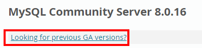
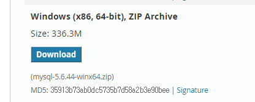

#### 2019 - 07 - 04 (7일차)

# 빅데이터 분석_Python 

jupyter notebook 실행!!


## 복습

```python
import numpy as np

## indexing
# numpy array 하나를 생성해보기!
# python의 range와 같이 특정 구간에 있는 연속적인
# 데이터를 이용해서 numpy array를 만드는 경우
arr = np.arange(0,10,1)
print(arr)
print(arr[0]) # indexing
```

```python
import numpy as np

## slicing 
# python의 list에 대한 slicing은 특정 구간에 대한
# 데이터를 복사해서 새로운 list를 생성.
# numpy array의 slicing은 View를 생성
# 원본과 데이터를 공유하고 shape가 다른 ndarray를 생성

print(arr[0:3])
```

```python
import numpy as np

## bollean indexing 
## boolean mask :  true와 false로 이루어진  array
arr = np.array([[1,2,3],[4,5,6],[7,8,9]])
print(arr)

# numpy array에 대해 수학적 사칙연산 (+, -, *, /, % ...)을 
# 수행하려면 두 개의 numpy array가 같은 shape를 가져야 한다.
# 만약 shape이 다르면 broadcasting을 통해서 shape를 맞춰준다.
# broadcasting : 모양이 다른 배열들 간의 연산이 어떤 조건을 만족했을 때 가능해지도록 배열을 자동적으로 변환하는 것
arr_1 = np.array([[10,20,30],[40,50,60],[70,80,90]])
print(arr_1)

print(arr + arr_1) 

arr_1 = np.array([10,20,30])
print(arr + arr_1) # broadcasting 

arr_1 = 5
print(arr + arr_1)
```
```python
import numpy as np

## % 연산
print(arr % 2)
print(arr % 2 == 0) # boolena mask를 생성
print(arr[arr % 2 == 0]) # boolean indexing : true만 뽑아내서 값 출력
```
## Broadcasting


```python
import numpy as np

## Fancy indexing
# numpy array의  index 배열을 이용해서 배열 요소를 참조하는 방법

# 랜덤값을 이용해서 numpy array를 생성
# 정수형 난수를 생성 : randint(시작(포함),끝(불포함),shape(tuple로표현))
# 2 차원으로 생성

np.random.seed(10) # 초기값을 고정시켜주는거
arr = np.random.randint(0,10,(5,5))
print(arr)

print(arr[1,1]) # 행과 열에 대한 일반적인 indexing
print(arr[1,:]) # 일반적인 indexing + slicing
print(arr[1,:3])
# [0 1 8 9 0]에서 0  8  0 만 출력할려는 경우 : Fancy indexing사용
print(arr[1,[0,2,4]]) # Fancy indexing 0,2,4 각각 index위치값을 적어주면됨
```

행렬곱 (내적)


```python
import numpy as np

arr_1 = np.array([[1,2],[3,4],[5,6]]) # 3 X 2
arr_2 = np.array([[1,2,3],[4,5,6]]) # 2 X 3
print(np.matmul(arr_1,arr_2))
```
```python
# numpy array가 제공하는 함수

import numpy as np

np.random.seed(10) # 초기값 고정
arr = np.random.randint(0,10,(3,4)) # 3행 4열
print(arr)

# 합계
print(arr.sum()) 
print(np.sum(arr)) 

# 평균
print(arr.mean())

# 최대값
print(arr.max())

# 최소값
print(arr.min())

# 표준편차
print(arr.std())

# 제곱근
print(np.sqrt(arr))

### 여기까지는 별로 어렵지 않아요/ ###
## 이런 함수를 사용할 때 축(axis)이라는 개념을 이용해서 사용
## 위의 함수를 사용할 때 axis를 명시하지 않으면
## axis=None으로 설정된다. 
## => numpy array 전체에 대해 함수를 적용
## 축은 숫자로 표현한다. numpy array가 몇차원이냐에 따라 숫자의 의미가 달라짐
```

```python
# 1차원배열
arr1 = np.array([1,2,3,4,5])
## 1차원의 numpy array가 생성, axis=0 => 열방향
print(arr1.sum(axis=0)) # 15 , 1차원은 axis를 0을 쓰던가 안쓰면된다.
# print(arr1.sum(axis=1)) # 에러뜸
```


```python
# 2차원 배열
arr = np.array([[1,2,3],[4,5,6],[7,8,9],[10,11,12]])
print(arr)
print(arr.sum(axis=None))
print(arr.sum(axis=0)) #  axis=0 => 행방향
```


- 직계함수를 사용하고 안하고는 속도와 메모리 차지하는 부분에 영향

```python
## 집계함수의 처리속도(sum)
import numpy as np

arr_ = np.arange(1000000) # [0,1,2,3, ..... ,999999]
```

```python
%%time
## jupyter notebook에서 셀이 수행되는 시간을 찍어줌 , %%time => 순서 맨위에 찍어줘야함
result = 0
for i in arr_:
    result += i
print(result)   
```

```python
%%time
print(arr_.sum())
```

```python
# np.unique()
arr = np.array([1,2,3,1,2,3])
print(np.unique(arr))
```

## MovieLens

MovieLens 설치

[사이트](https://grouplens.org/datasets/movielens/)


ratings.csv 사용


**데이터 전달 포맷**

1. CSV ( Comma Seperated Value 

   부가적인 데이터가 많지 않아서 대용량의 데이터를 표현 할 때 적합

2. XML

3. JSON


userId,movieId,rating,timestamp => 컬럼( Cloumn )명 => #이용해서 주석처리 해야함, 안하면 오류남

1,1,4.0,964982703

1,3,4.0,964981247

1,6,4.0,964982224

1,47,5.0,964983815

1,50,5.0,964982931

1,70,3.0,964982400

=> 데이터들 numpy array 하나하나에 넣어야함 => 2차원형태의 array / 구분자 : ,

```python
## MovieLens 데이터 파일을 이용
## Group Lens에서 수집한 영화에 대한 평점 데이터
## 영화에 대한 선호도 1점~5점까지로 표현
```

```python
# MovieLens Data 파일 분석
import numpy as np
#  1. 데이터 로딩 (CSV 파일로부터 데이터를 읽어들인다.)
# => np.loadtxt()사용 / # tab눌러서 자동완성
data = np.loadtxt("data/movielens/ratings.csv",
                 delimiter=",", dtype=np.float64) 
# delimiter : 구분자 , dtype-> int32(정수)도 해보기 float64(실수)

# 2. 상위 5개의 행만 출력해보기
print(data[:5,:]) # data[행 , 열]) 
# 한번 수행하면 메모리에 남아있으니까 셀 바꿔서 하기!
```

```python
# 모든 영화에 대한 전체 평균 평점은? => 평균 : mean()
print(data[:,2].mean())

mean_rate = data[:,2].mean()
print(mean_rate)
print(data.shape)
```

```python
# 각 사용자별 평균 평점은?  1번사용자...2번사용자...
```
## Pandas

```python
## pandas는 python data 분석의 핵심 module(package)
## 데이터 분석
## 1. EDA(탐색적 데이터 분석) : 예) 엑셀로 데이터 분석
## python 언어로  pandas 를 이용해서 EDA를 수행
## 2. 통계적 데이터 분석 : 통계적쪽 이론을 이용한 분석
## 3. 머신러닝 : 기존 데이터를 이용해서 프로그램을 학습
##               이 학습된 결과를 이용해서 예측
## (딥러닝)

## Pandas 는 고유한 자료구조를 2개 사용한다.(numpy의 1,2차원배열과 유사)
## Series : numpy의 1차원 배열과 상당히 유사
##          동일한 데이터 차입의 복수개의 요소로 구성.
## DataFrame : table형식으로 구성된 자료구조
##             2차원배열과 상당히 유사
##             데이터베이스 테이블과 상당히 유사 (데이터타입 상관없음 , 칼럼만 같으면됨)
```

import numpy as np

**import pandas as pd** 설치안되서

에러남

​	=> **Pandas 설치하기** 

​	=> prompt관리자권한으로 실행 -> activate cpu_env -> conda install pandas

```python
import numpy as np
import pandas as pd

print("=" * 30)
arr = np.array([-1,10,50,99], dtype=np.float64)
print(arr)
print("=" * 30)

# Series라 불리는 1차원 배열 만들기
s = pd.Series([-1,10,50,99], dtype=np.float64)
display(s) # Series와 DataFrame만 출력할때 display()이용
print(s.values) # numpy 1차원 array로 리턴
print(s.index)
print(s.dtype)

# pandas는 index도 출력
```

```python
import numpy as np
import pandas as pd

# pd.Series() : 순서대로 자료정리, index를 정의해서 쓸수 있음
s = pd.Series([-1,10,50,99], index=["c","a","k","tt"])
display(s) # 전체구조 -> display()
print(s["a"]) # 다른 형식의 index를 사용가능
print(s[1]) # index 이름을 변경 했더라도 원래의 형태의 숫자 index 사용가능
print(s[1:3]) # 일반적인 slicing 가능, Series를 slicing 하면 결과값 : Series형식 
# 문자기반 indexing - 슬라이싱되는 범위에 주의
print(s["c":"k"]) # 숫자는 indexing하면 앞포함 뒤불포함인데
                  # 문자는 indexing하면 앞,뒤 포함 
print(s.sum()) # 집계함수 제공되기때문에 함수사용가능
```

```python
## 문제
# A 공장의 2019-01-01부터 10일간 제품 생산량을 Series에 저장
# 단, 생산량의 평균은 50이고 표준편차는 5인 정규분포에서 
# 생산량을 랜덤하게 결정

# Series의 index로 날짜를 사용

# B 공장의 2019-01-01부터 10일간 제품 생산량을 Series에 저장
# 단, 생산량의 평균은 70이고 표준편차는 8인 정규분포에서 
# 생산량을 랜덤하게 결정

# 2019-01-01 부터 10일간 공장(A,B)의 생산량을 날짜별로 출력

import numpy as np
import pandas as pd
from datetime import date,timedelta
from dateutil.parser import parse

start_day = parse("2019-01-01")
print(start_day)
# Series()의 data와 index를 list의 형식으로 

                          # 정수화시키기위해       # 1차원형태로 10개
factory_a = pd.Series([int(x) for x in np.random.normal(50,5,(10,))],
                       index=[start_day + timedelta(days=x) for x in range(10)])
display("factory_a",factory_a)

print("=" * 30)

factory_b = pd.Series([int(x) for x in np.random.normal(70,8,(10,))],
                       index=[start_day + timedelta(days=x) for x in range(10)])
display("factory_b",factory_b)  

print("=" * 30)

display("factory_a 와 factory_b의 합", factory_a + factory_b)
```

```python
# 이전에는 Series라는 자료구조를 만들때 python의 list를 이용해서 만들었는데 
# 이번에는 dictionary를 이용해서 만들어보기! dictionary => key,value
import numpy as np
import pandas as pd

my_dict = {"서울" : 3000, "부산" : 2000, "제주" : 8000}
s = pd.Series(my_dict)

s.name = "지역별 가격 데이터"
s.index.name = "지역"
display(s) # dictionary의 key값이 Series의 index값으로 잡힘
```

```python
## pandas의 두번째 자료구조인 DataFrame
## 거의 대부분의 경우 DataFrame을 이용해서 데이터 분석
## DataFrame : Series의 집합, python dictionary를 이용해서 생성
import numpy as np
import pandas as pd
                # list
data = { "name" : ["kim","lee","park","moon","kim"],
         "year" : [2015, 2016, 2019, 2019, 2015],
         "point" : [3.1, 4.3, 1.2, 2.3, 3.9]}

df = pd.DataFrame(data)
display(df) # table의 구조로 결과가 나옴 => DataFrame -> 데이터 처리할때 사용하면 편리
print("DataFrame의 shape : {}".format(df.shape))
print("DataFrame의 요소개수 :{}".format(df.size))
print("DataFrame의 차원 :{}".format(df.ndim))
print("DataFrame의 인덱스 :{}".format(df.index))
print("DataFrame의 컬럼 :{}".format(df.columns))
print("DataFrame의 데이터 :{}".format(df.values)) # 전체 타입 : object로 되어있는 numpy array
```


주석되어있던걸 풀어줘야 한다.

```python
## CSV파일을 이용해서 DataFrame을 생성해 보아요
## 일반적으로 CSV파일의 첫번째 행은 컬럼을 명시
# DataFrame은 쉽게 사용가능한 함수들이 있다.
import numpy as np
import pandas as pd

df = pd.read_csv("./data/movielens/ratings.csv")
# display(df)
print(df.shape)
display(df.head()) # head() : 앞에있는 5개 출력 , tail() : 뒤에있는 5개 출력
```

Database로 부터 데이터를 얻어내서 DataFrame을 생성

Database는 mysql을 이용해서 처리해보기

python에서 mysql을 사용할 수 있도록 도와주는 module을 설치

import pymysql  =>  오류남

​	=> module을 설치

​	=> prompt관리자권한으로 실행 -> activate cpu_env -> conda install pymysql

```python
## Database로 부터 데이터를 얻어내서 DataFrame을 생성
## Database는 mysql을 이용해서 처리해보기
## python에서 mysql을 사용할 수 있도록 도와주는 module을 설치
import pymysql.cursors
import numpy as np
import pandas as pd
```

mysql을 다운로드 받아서 간단하게 설치-설정 (https://www.mysql.com/)




현재버전 말고  5.6 버전 다운로드 





1. 다운로드 받은 mysql5.6.x.zip파일을 바탕화면에 압축을 푼다.

2. command창의 working directory를 mysql안에 bin폴더로 이동.

​		C:\Users\student\Desktop\mysql-5.6.44-winx64\mysql-5.6.44-winx64\bin

​		shift누르고 폴더 빈화면에 마우스 우클릭


3. 일단 DBMS 기동 => mysql


​		X표시 누르면안됨 누르면 데이터베이스 서버 죽음

​		성공적으로 실행되면 minimize해요.(종료하지 말고)

4. mysql 서버가 실행되고 있는 상태이기 때문에 다른 commad창을 이용해서 mysql console로 진입 cd

   ( > mysql –u root )

5. mysql console에 진입하면 mysql>로 프롬프트가 변경

6. 새로운 사용자를 생성

   mysql> create user python identified by “python”;

   mysql> create user python@localhost identified by “python”;

7. Database를 생성해야해요

   mysql> create database library;

8. 새로운 사용자에게 database사용 권한을 부여

   mysql> grant all privileges on library.* to python;

   mysql> grant all privileges on library.* to python@localhost;

9. console에서 command 창으로 빠져 나가요.

   mysql> exit

10. command창에서 제공된 script file을 이용해서 database를 빌딩

    C:\Users\student\Desktop\mysql-5.6.44-winx64\mysql-5.6.44-winx64\bin에 

    

    이 파일을 가져다 놓기!!!

    \> mysql –u python –p library < _tableDump.sql  => library에 tableDump.sql 파일 넣는거


```python
## Database로 부터 데이터를 얻어내서 DataFrame을 생성
## Database는 mysql을 이용해서 처리해보기
## python에서 mysql을 사용할 수 있도록 도와주는 module을 설치
import pymysql.cursors
import numpy as np
import pandas as pd

## mysql을 다운로드 받아서 간단하게 설치-설정
## 데이터베이스를 연결하기 위한 변수를 하나 생성
conn = pymysql.connect(host="localhost",
                      user="python",
                      password="python",
                      db="library",
                      charset="utf8")
sql = "select bisbn,btitle,bauthor,bprice from books"

df = pd.read_sql(sql,con=conn)
display(df)
```

