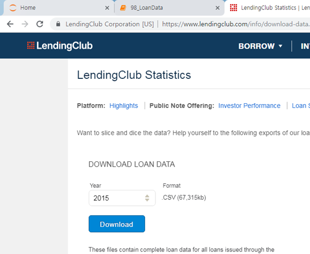
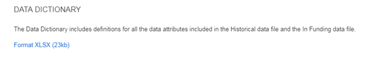
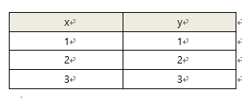
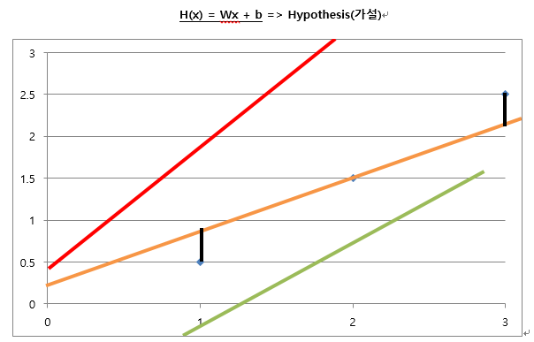
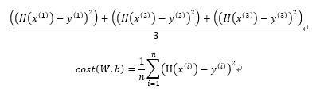
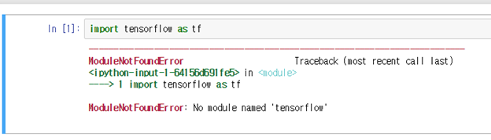
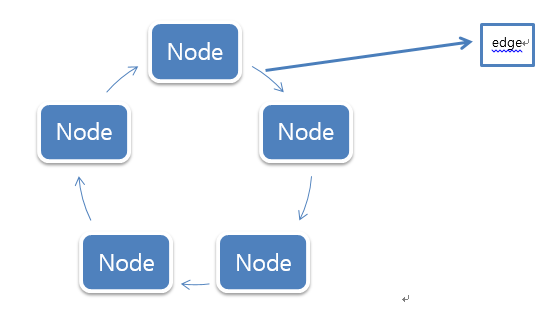
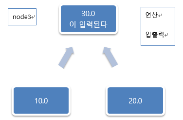

#### 2019 - 07 - 10 (10일차)

# 빅데이터 분석_ Python 

lending club data 다운로드

https://www.lendingclub.com/info/download-data.action



csv파일로 zip으로 해서 다운로드



일반적으로 어떤데이터형식으로 가지고 있는지 data dictionary로 표현해준거


----

- Linux 

  => 추후 하둡 시스템을 사용하기 위해서 간단한 형태로 시스템 명령어 위주로 학습

- python 

  => 기본 언어 특성

- numpy

  => ndarray라는 자료구조와 여러가지 함수를 제공

- pandas

  => 데이터 분석(탐색적 데이터 분석(EDA))을 하기 위한 python module


## Tensorflow

- machine learning(머신러닝, 기계학습)    - TensorFlow

  => 데이터 분석의 또 다른 방법 , 예측에 관련된 데이터 분석

  => machine learning은 소프트웨어

  => Explicit Programming의 한계 때문에 주목받음

  ​	=> Explicit Programming은 우리가 일반적으로 하는 프로그래밍

  ​	=> Explicit Programming으로 해결할 수 없는 문제들이 있음 (경우의 수가 많음)

  ​	=>대표적인 것들로 자동운전시스템, 바둑프로그램, 이메일 스팸 필터 등

- machine learning의 종류(분류)

- **Supervised Learning** : training set 이라고 불리는 label화 된 데이터를 이용해 학습 

  예측모델을 생성한 후 예측모델을 이용해서 실제 데이터를 예측

  => 우리가 관심이 있어야 하는 모델

  => 다시 3가지 종류로 나뉜다.
  
  
  
  1)**Linear regression** (선형회귀) : ex) 몇 점을 받을 수 있는지
  
   추측한 결과값이 선형값 (값의 분포가 제한이 없다.)
  
  
  
  
  
  - **Linear Hypothesis** (선형가설)

    Linear Hypothesis를 정의하는 것은 training data set에 잘 맞는 linear한 선을 긋는 것으로 생각할 수 있다.

    Hypothesis를 수정해 나가면서 데이터에 가장 적합한 선을 찾는 과정이 바로 학습.

    우리가 원하는 것은 training data set에 가장 적합한 W와 b의 값을 찾는 것

    => 가장적합한 W와 b의 값을 찾으려면?

    ​	 Cost(Loss) Function 사용 – 최소제곱법

    ​	 가설과 training data 간의 값의 차를 계산하는 함수 : **H(x) = Wx + b**



​	2) **Logistic regression** (Binary Classification) :  ex) 합격 불합격

​				추측한 결과값이 논리값 (2개중의 1개)

​	3) **Multinomial(Multi-label) Classification** : ex) A-F까지의 grade

​				추측한 결과값이 논리값 (정해져 있는 여러 개 중 1개)

- **Unsupervised Learning** : 데이터에 label이 없다. (label화 되지 않은 데이터를 통해 학습)

  ​											   비슷한 데이터끼리 clustering 모델

  ​											   News Grouping 같은 경우 데이터를 이용해 스스로 학습

Supervised Learning는 예측모델 Unsupervised Learning은 분류모델

앞으로 예측모델에 관해서 이야기 할꺼임

- machine learning의 일반적인 응용
  - 이미지 검색
  - 고객 등급 예측

  - 도난 신용카드 판별

  - 시험 성적 예측

  - 예상 매출액 산출


## jupyter notebook 에서 tensorflow 사용하기

1. tensorflow module 설치 ( cpu용 )



프롬프트창 관리자 모드로 실행 

\> activate cpu_env

\> conda install tensorflow 

\> y하고 엔터 

설치 끝

```python
## 1.tensorflow module 설치 ( cpu용 )
## > conda install tensorflow

import tensorflow as tf
```

```python
## 2. Hello World 출력
## 상수를 하나 만들어요( 상수 Node 생성 )
## Tensorflow Node는 숫자 연산과 데이터 입출력을 담당.
## Session을 이용해서 Node를 실행시켜야지 Node가 가지고 있는 데이터를 출력할 수 있다.

my_node = tf.constant("Hello World")

sess = tf.Session()
print(sess.run(my_node).decode()) # b'Hello World'에서 b : binary text / .decode()는 원래 형태대로 출력해줌
```



```python
## TensorFlow : Google이 만든 machine library 
##              open source library
##              수학적 계산을 하기 위한 library
##              data flow graph를 이용해요~! ( node와 edge로 이루어진 방향성있는)

## data flow graph는 Node와 Edge로 구성된 벙향성 있는 graph

## Node : 데이터의 입출력과 수학적 연산
## Edge : Tensor를 Node로 실어 나르는 역할
## Tensor : 동적 크기의 다차원 배열을 지칭
```

```python
import tensorflow as tf

node1 = tf.constant(10, dtype=tf.float32)
node2 = tf.constant(20, dtype=tf.float32)

node3 = node1 + node2
```



```python
## 그래프를 실행시키기 위해 runner의 역할을 하는 Session객체가 있어야한다.
sess = tf.Session()
# print(sess.run(node3))
# print(sess.run(node1,node2)) # 복수개의 노드를 실행하려면 배열형태로 입력해야함!!
print(sess.run([node1,node2,node3]))
```

```python
import tensorflow as tf
#  placeholder 를 이용
# 2개의 수를 입력으로 받아서 더하는 프로그램
node1 = tf.placeholder(dtype=tf.float32) # placeholder: 입력 데이터를 받아들이기위한 저장공간  / 값이 없을때 사용
node2 = tf.placeholder(dtype=tf.float32)

node3 = node1 + node2

sess = tf.Session()
result = sess.run(node3, feed_dict={node1 : 10 , node2 : 20}) # key와 vlaue의 값으로 할당
print(result)
```

```python
import tensorflow as tf

node1 = tf.constant([10,20,30], dtype=tf.int32)
print(node1)
node2 = tf.cast(node1, dtype=tf.float32)
print(node2)

# ★연산할때마다 항상 데이터 타입 같게!!!★
```

```python
import tensorflow as tf

# training data set
x = [1,2,3]
y = [1,2,3] # label

# 선형회귀 ( linear regression )
# 가장 큰 목표는 가설의 완성
# 가설( hypothesis ) = Wx + b
# W와 b를 정의( 변수로 )
# Weight 와 bias의 정의
W = tf.Variable(tf.random_normal([1]),name="weight") # tensorflow node로 만들꺼임 # Variable : 변수처럼 동작하는 데이터
# random_nomal() :  표준정규분포  , 배열형태로 어떻게 출력할지 적어줘야함
b = tf.Variable(tf.random_normal([1]),name="bias")

# W도  node b도 node => 결과 값도 node

# Hypothesis( 가설 )
# 우리의 최종 목적은 training data에 가장 근접한 Hypothesis로 만드는 것 (W와 b를 결정)
# 잘만들어진 가설은 W가 1에 가깝고 b가 0에 가까워야한다.
H = W * x + b # H(x) = Wx + b 를 수학적 식으로 표현

# cost(loss) Function
# 우리의 목적은 cost 함수를 최소로 만드는 W와 b를 구하는 거다.
cost = tf.reduce_mean(tf.square(H - y)) # reduce_mean() : 평균구하는거 / tf.square() : 제곱하라는거 

## cost function minimize (최소화)
optimizer = tf.train.GradientDescentOptimizer(learning_rate=0.01) #  tf.train.GradientDescentOptimizer() - 미분
train = optimizer.minimize(cost)

## runner 생성 - 그래프를 생성하기위한 session 객체
sess = tf.Session()
## global variable의 초기화
sess.run(tf.global_variables_initializer())

## 학습을 진행  - 한번에 최소값을 얻어낼수 없고 기본값보다 작은값을 얻을 수 있도록 하는 식을 현재 작성한거임 
## => 반복하다보면 제일작은 값이나옴
for step in range(4000):
    # 반복하면서 train을 실행시킬꺼임
    _, w_val, b_val, cost_val =  sess.run([train,W,b,cost])
    if step % 300 == 0: 
        print("W:{},b:{},cost:{}".format(w_val,b_val,cost_val))
```
