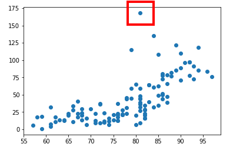
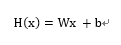
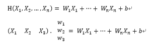
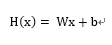
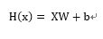

#### 2019 - 07 - 11 (11일차)

# 빅데이터 분석_ Python

**GRADIENT  DESCENT ALGORITHM**의 예외

 

**Convex Function**

Cost Function은 Convex Function의 형태가 되어야 GRADIENT  DESCENT  ALGORITHM을 사용할 수 있다.

​	=> Cost Function을 설계할 때 Convex Function의 형태를 가지는지 확인해야 한다.




ㅁ표시된부분 => 나중에 문제가 될수있다.


Multi-variable(multiple) linear regression

 여러 개의 input을 이용한 linear regression

 

Hyporthesis

​      변수가 1개일 때 Hyporthesis



​	Cost function



​	기본이론



​	실제구현



```python
import tensorflow as tf

## training data set
x = tf.placeholder(dtype=tf.float32) # placeholderce() : 입력 파라매터를 받는 변수
y = tf.placeholder(dtype=tf.float32) 

x_data = [1,2,3,4]
y_data = [4,7,10,13] 

# Weight & bias : 초기화를 해줘야함
W = tf.Variable(tf.random_normal([1]), name="weight")  # 초기값을 줄때 0과 근_?한 랜덤하게 줄꺼임 / ([]) 배열형태로 스칼라형태로 쓴다./ name : 변수마다 이름부여
b  = tf.Variable(tf.random_normal([1]), name="bias")

# x,y,W,b => tensorflow node , H도 결과적으로 tensorflow node

# Hypothesis : 가설
H = W * x + b  # 1차식에 대한 수학식
# Hypothesis를 정의할려면 weight 와 bias가 정의가 먼저 되어야함

# cost(loss) Function
cost = tf.reduce_mean(tf.square(H - y)) # squre() : 제곱을 의미

# cost function을 최소화 시키기 위한 작업
# GRADIENT DESCENT ALGORITHM 사용 : optimizer 
optimizer = tf.train.GradientDescentOptimizer(learning_rate = 0.01)
train = optimizer.minimize(cost)

# tensorflow 그래프를 실행시키기 위한 Session & 초기화
## runner 생성 - 그래프를 생성하기위한 session 객체
sess = tf.Session()
## global variable의 초기화
sess.run(tf.global_variables_initializer())

# 학습 : 반복적으로 실행시켜서 w와 b의 값을 구해내는것
for step in range(300000): 
    # range(?) : ?의 반복횟수 값을 크게 하면 좋은데 높게 잡아버리면 시간이 오래걸린다...
    _, cost_val = sess.run([train,cost], feed_dict={x:x_data, y:y_data}) 
    # 이렇게하면 w와 b가 제대로 나오는지는 확인할 수 없다. 그래서 cost을 같이 뽑아냅 
    # cost값을 알면 제대로 학습이 된지 알수 있다. / _. : 사용하지 않겠다는 의미
    if step % 300 == 0:
        print(cost_val)

# prediction : 예측값 추출 
sess.run(H, feed_dict={x:[300]}) # x값이 주어졌을때 y값 예측
```

```python
import tensorflow as tf
import numpy as np
import pandas as pd   # pandas로 파일읽어서 데이터 읽는 작업을 하는게 좋음
import warnings       # action=ignore
import matplotlib.pyplot as plt

warnings.filterwarnings(action="ignore")
```

```python
## 1. pandas를 이용 데이터 불러와서 데이터 프레임만들기
df = pd.read_csv("./data/ozone/ozone.csv", sep=",") # sep :  구분자
display(df)
```

```python
## 온도에 따른 오존양 예측 / 오존양에 미치는 요소들 :Solar.R, Wind, Temp
## 필요한 columns 먼저 추출

# Fancy indexing
df2 = df[["Ozone","Temp"]] 
# 결측값을 처리(제거)
df3 = df2.dropna(how="any", inplace=False)  
print(df2.shape)
print(df3.shape)
```

```python
## 이렇게 준비한 데이터가 linear한 데이터인지 확인
# plt.scatter() : 데이터가 흩어진 형태를 보여줌 (어떻게 분포되어있는지)
plt.scatter(df3["Temp"],df3["Ozone"]) # X 데이터: Temp, Y 데이터 : Ozone
plt.show()
```

```python
# placeholder
x = tf.placeholder(dtype=tf.float32)
y = tf.placeholder(dtype=tf.float32)

# training data set
# 데이터 정제 필요!!! ## normalization : ( 요소값 - 최소값 ) / ( 최대값 - 최소값 )
x_data = (df3["Temp"]-df3["Temp"].min())/(df3["Temp"].max()-df3["Temp"].min()) # Series 형태로 나옴
y_data = (df3["Ozone"]-df3["Ozone"].min())/(df3["Ozone"].max()-df3["Ozone"].min())

# Weight & bias
W = tf.Variable(tf.random_normal([1]), name = "weight")
b = tf.Variable(tf.random_normal([1]), name = "bias")

# Hypothesis
H = W * x + b

# Cost Function
cost = tf.reduce_mean(tf.square(H - y))

# 최소화 노드생성
optimizer = tf.train.GradientDescentOptimizer(learning_rate = 0.1)
train = optimizer.minimize(cost)

# Session 초기화
sess = tf.Session()
sess.run(tf.global_variables_initializer())

# 학습(train)
for step in range(3000):
    _, cost_val = sess.run([train,cost], feed_dict={x:x_data, y:y_data})
    
    if step % 300 == 0:
        print("cost : {}".format(cost_val)) # cost 값이 nan으로 발산하고 있음 => 값이 이상하게 나오는거...
```

```python
## 0과 1 사이의 값으로 정규화 처리를 해줘야한다.. 그래야지 제대로된 학습이 가능하다.

## normalization : ( 요소값 - 최소값 ) / ( 최대값 - 최소값 )
## standardization : ( 요소값 - 평균 ) / 표준편차  # 음수값도 나올 수 도 있따
df3
## pandas를 이용해서 새로운 DataFrame생성해서 학습해보기
```

```python
import tensorflow as tf

# 2차원형태 matrix
# training data set

x_data = [[73,80,75],
          [93,88,93],
          [89,91,90],
          [96,96,100],
          [73,66,70]]

y_data = [[152],[185],[180],[196],[142]]

# placeholder
X = tf.placeholder(shape=[None,3], dtype=tf.float32) # shape=[5,3] : 5행 3열인 2차원배열(matrix)
Y = tf.placeholder(shape=[None,1], dtype=tf.float32) # 행의 개수는 변할수 있기 때문에 None(상관하지 않겠다.don`t care의미)로 쓴다.

# weight & bias
W = tf.Variable(tf.random_normal([3,1]), name = "weight") # 행렬곱해서 W가 3행 1열 / matrix로 난수의 형태로 뽑을꺼임
b = tf.Variable(tf.random_normal([1]), name = "bias")

# Hypothesis
# H = W * x + b
H = tf.matmul(X,W) + b

# Cost Function
cost = tf.reduce_mean(tf.square(H - Y)) # square : 어떤데이터타입이 들어오든 알아서 계산해쥼

# 학습노드 생성
train  = tf.train.GradientDescentOptimizer(learning_rate=0.01).minimize(cost)

# Session & 초기화
sess = tf.Session()
sess.run(tf.global_variables_initializer())

# for문
for step in range(3000):
    _, cost_val = sess.run([train,cost], feed_dict={X:x_data, Y:y_data})
    
    if step % 300 == 0:
        print("cost : {}".format(cost_val))
```

```bash
# Sklearn 모듈 설치
$ pip install sklearn
```

```python
## 위에 문제 풀이
import tensorflow as tf
import numpy as np
import pandas as pd
from sklearn.preprocessing import MinMaxScaler # 데이터 정제 => sklearn모듈 MinMaxScaler함수사용 : 정규화작업 

# Data Loading
df = pd.read_csv("./data/ozone/ozone.csv", sep=",")

# 필요한 컬럼만 추출
df.drop(["Month","Day"], axis=1, inplace=True) # drop은 컬럼과 로우 모두 지울수 있기때문에 axis를 줘야함 axis=1 열방향

# 결측값 처리(제거)
df.dropna(how="any", inplace=True)

# x 데이터 추출
df_x = df.drop("Ozone", axis=1, inplace=False)
# display(df_x)
# y 데이터 추출
df_y = df["Ozone"]
# display(df_y) # Series로 떨어짐 => values

# training data set
x_data = MinMaxScaler().fit_transform(df_x.values)
y_data = MinMaxScaler().fit_transform(df_y.values.reshape([-1,1])) # 데이터를 1열로 만들어서 2차원형태로 변경

# placeholder
X = tf.placeholder(shape=[None,3], dtype=tf.float32)
Y = tf.placeholder(shape=[None,1], dtype=tf.float32)

# Weight & bias
W = tf.Variable(tf.random_normal([3,1]), name="weight")
b = tf.Variable(tf.random_normal([1]), name="bias")

# Hypothesis
H = tf.matmul(X,W) + b

# Cost Function
cost = tf.reduce_mean(tf.square(H - Y))

# train node 생성
train = tf.train.GradientDescentOptimizer(learning_rate=0.01).minimize(cost)

# Session & 초기화 
sess = tf.Session()
sess.run(tf.global_variables_initializer())

# 학습진행 - 반복 - for문
for step in range(30000):
    _, cost_val = sess.run([train,cost], feed_dict={X:x_data, Y:y_data})
    
    if step % 3000 == 0:
        print("cost : {}".format(cost_val))
        
# prediction
print(sess.run(H, feed_dict={X:[[190,7.4,67]]})) # placeholder에 정의된 shape를 따라줘야함 / 190,7.4,67,5
```

