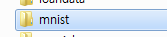
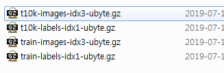

#### 2019 - 07 - 15 (13일차)

# 빅데이터 분석_ Python

## machine learning

```python
# machine learning의 3가지 분류
# 1. supervised learning(지도학습)
#  => training data에 label이 부여되어 있다
# 2. unsupervised learning(비지도 학습)
#  => traing data에 lable이 존재하지 않음
#  => clustering작없이 일반적으로 진행
# 3. 강화학습
#  => 상점과 벌점을 이용하여 점점 더 좋은 방향으로 학습해 나가는 방식

# Supervise Learning(지도학습)
# 1. single linear regression(단순 선형회귀) - x 한개, y 한개 존재하는 경우
# 2. multiple linear regression(다중 선형회귀)
#  => multrix
# 3. logistic regression(binary classification) -둘중에 한개의 값으로 판단
# 4. Multinomial classification - 여러개 중에 한개의 값으로 판단

# 추가적으로 알아야 할 내용
# Large learning rate 인 경우
#  Overshooting - W값 ,값이 클경우 이동 거리가 큼
# Small learing rate 인 경우
#  local minimum문제에 봉착할 수 있음(값을 못찾는 문제)

# learning rate- 0.01값으로 시작
# 입력데이터의 값이 범위가 클 경우 
# - 학습진행이 되지 않는다
# - normalization (정규화),standardization (표준화) 진행되어야 함. 일반적으로 normalization 사용됨

# Overfitting
# -training data set에는 아주 적합한 모델이지만 실제 데어터에는 적용이 안되는 경우
# Evaluation
# - training data와 test data 분리하여 평가(8:2, 7:3)

# MNIST
# 예) 우편번호를 스캔하여 읽어들인 숫자 하나하나 픽셀값을 학습시켜서 
# 새로운 값이 들어왔을때 예측을 시킴
# 숫자에 대한 픽셀정보(28*28)를 학습
# =>이 픽셀정보가 어떤숫자인지 알려주는 label도 제공(0~9)
```

```python
## 기본 MNIST 예제 (multinomial classification)
import tensorflow as tf
import matplotlib.pyplot as plt
import numpy as np
from tensorflow.examples.tutorials.mnist import input_data

# Data Loading 
mnist = input_data.read_data_sets("./data/mnist", one_hot=True) # 폴더를 만들고 데이터 저장 , 압축파일 파일 압축풀 필요없음
```





```python
# 데이터 확인
# print(mnist.train.num_examples) # 학습용 데이터의 개수 / 학습용 = train , 테스트용 = 
# print(mnist.train.images.shape) # (55000, 784)
#                                 #  28 X 28 이미지를 1차원 형태로 저장
# print(mnist.train.labels.shape)

# plt.imshow(mnist.train.images[0].reshape(28,28), cmap="Greys", interpolation="nearest") # 1차원데이터를 2차원데이터로 변경
# # 55000개의 그림중에 이미지를 선택해서 픽셀정보를 줘야한다.
# plt.show()
# print(mnist.train.labels[0])

# placeholder
X = tf.placeholder(shape=[None, 784], dtype=tf.float32) 
Y = tf.placeholder(shape=[None, 10], dtype=tf.float32)

# Weight & bias
W = tf.Variable(tf.random_normal([784,10]), name="weight")
b = tf.Variable(tf.random_normal([10]), name="bias")

# Hypothesis / 각각에 대한 확률을 구해야한다.
logits = tf.matmul(X,W)+b  # 행렬곱을 기본으로 잡는다.
H = tf.nn.softmax(logits)

# Cost Function
cost = tf.reduce_mean(tf.nn.softmax_cross_entropy_with_logits_v2(logits=logits, labels=Y))

# train node 생성
# optimizer = tf.train.GradientDescentOptimizer(learning_rate=0.01)
train = tf.train.GradientDescentOptimizer(learning_rate=0.01).minimize(cost)
# train = optimizer.minimize(cost)

# Session & 초기화
sess = tf.Session()
sess.run(tf.global_variables_initializer())

""" 
사용하는 데이터의 크기가 상당히 크다.
메모리의 문제때문에 한번에 불러올수 없다.
데이터의 크기에 상관없이 학습하는 방식이 필요하다.!! => 잘라서 학습하는 방식으로 수행
epoch : training data를 1번 학습시키는 것.
"""
# epoch 학습진행
training_epoch = 30 # for 루프를 30만큼 돌린다는 의미
batch_size = 100 #  55000개의 행을 다 읽어들이는게 아니라 100개의 행을 읽어서 반복학습!! (아중루프가 돔) / 얼마만큼의 사이즈로 불러드릴껀지

for step in range(training_epoch): # 30 epoch 만큼 반복
    num_of_iter = int(mnist.train.num_examples /  batch_size) # 550번 끊어 읽겠다는 의미
    cost_val = 0
    for i in range(num_of_iter):
        batch_x, batch_y = mnist.train.next_batch(batch_size) 
        _, cost_val = sess.run([train,cost], feed_dict={X:batch_x , Y:batch_y})
        
    if step % 3 == 0:
        print(cost_val)     

# 학습진행
# for step in range(3000):
#     _, cost_val = sess.run([train,cost], feed_dict={X:mnist.train.images, Y:mnist.train.labels})
    
#     if step % 300 == 0:
#         print(cost_val)

# Accuracy(정확도) 측정
predict = tf.argmax(H,1)
correct = tf.equal(predict, tf.argmax(Y,1))
accuracy = tf.reduce_mean(tf.cast(correct, dtype=tf.float32))

result = sess.run(accuracy, feed_dict={X:mnist.test.images, Y:mnist.test.labels})

print("정확도 :{}".format(result))

# Prediction
## 종이에 숫자를 하나 써서 스캐너로 읽어들인 후 28*28의 형태의 픽셀 데이터로 변환
```


## Deep Learning

Kaggle

머신러닝 & 딥러닝 경진사이트

MNIST 예시들이 있다.