#### 2019 - 07 - 26 

# 빅데이터 분석_ Python

자바 api 설치

Tensorflow java api 검색

https://www.tensorflow.org/install/lang_java

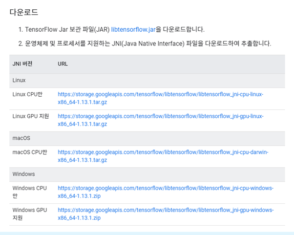

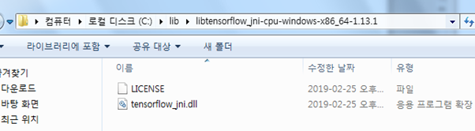

이파일이 로딩되는지 확인해야됨!!

이클립스에서 프로젝트 생성!! - 자바 기본프로젝트로!

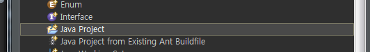

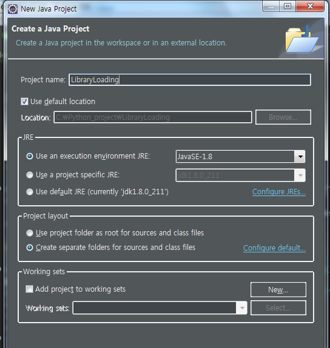

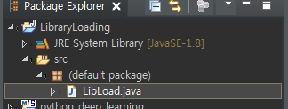

LibLoad 자바 클래스 생성

**오후**

Tensoeflow for Java ( Web Application )

1. CNN을 이용한 Deep Learning을 python으로 구현

   => 모델을 생성하고 학습을 진행하는 부분까지 구현

   => 이렇게 학습한 내용을 file로 저장

   => 파일에 저장되는 내용은 Tensorflow 그래프와 Variable 데이터

2. Web Application 작성 ( Java Servlet )

   => -Djava.library.path=C:\python_ML\DLL

   => WAS : Tomcat 7.0

   => 기본적인 설정 후에 round trip 방식의 web application 작성

   A. Daynamic Web Application을 작성

   ​	Context Root : Web상에서 프로젝트를 지칭하는 논리적인 이름 => cnn

   ​	url mapping : Web상에서 java program(servlet)을 지칭하기 위한 논리적인 이름 => sample

   ​	Get 방식으로 호출하려고 한다.

   ​	=> Brower의 주소창에 서버쪽 호출 URL을 입력해서 서버쪽 프로그램을 호출

   ​		[HTTP://localhost:8080/cnn.sample](HTTP://localhost:8080/cnn.sample)

   ​	=> Servlet의 doGet method가 호출

   ​			=> 입력받고, 로직처리, 출력처리

   ​	=> Tomcat에 의해서 우리 프로젝트가 서비스 되어있어야 해요!! => deploy

   ​	=> Round Trip 방식의 Web Application 실행

**특징**

- 화면이 refresh된다

  예전에는 별로 문제가 안됬어요~~!

  한창 JSP로 프로그램을 작성!!

- Web browser는 서버가 보내준 내용을 rendering하는 역할

  모든 데이터가 서버 쪽에서 생성되서 네트워크를 통해 데이터가 클라이언트에게 전송되는 구조

- Mobile 시대가 도래…

  데이터 사용량을 최소화 할 필요가 생기게 되었어요!

- 서버 쪽 프로그램과 프론트엔드 프로그램을 따로 작성

  HTML5로 프론트엔드 프로그램을 작성

  Jsp의 사용이 줄어들고 있고 **Ajax** 방식이 많이 사용되고 있음

  프론트엔드( react.js, view.js, angular ) =>javascript

- AJAX 방식으로 프로그램을 작성 / 데이터만 왔다갔다 하는 방식으로

- AJAX( XML을 사용해 서버와의 통신을 가능하게 해주는 javaScript 통신

- 순수 JavaScript AJAX구현이 복잡하고 유지보수가 쉽지 않아요 => jQuery

---

- 클라이언트 프로그램( HTML, CSS, JavaScript => HTML5 )을 작성( jQuery를 기반으로 작성 )

  => 예측하고 싶은 이미지를 선택해서 이 이미지의 픽셀 정보를 추출해서 이 데이터를 서버에 전송, 이 전송되는 픽셀 데이터는 [1,784] 형태의 데이터

- 서버 쪽 프로그램을 작성

  => 클라이언트가 보내준 [1,784] 형태의 픽셀데이터를 받아서 CNN 딥러닝 모델을 이용해서 Prediction작업 후 결과 데이터를 클라이언트에게 전송.

---

콘다 관리자권한 실행해서 파일경로로 들어간뒤 py파일 실행시키기

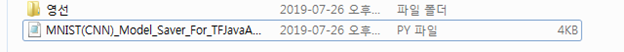

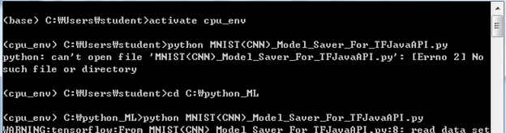

**MNIST(CNN)_Model_Saver_For_TFJavaAPI.py**

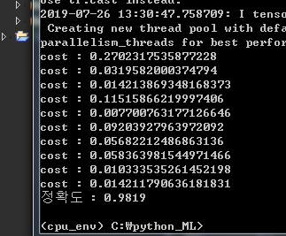

새로운 이클립스 ML_workspace 생성

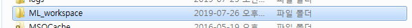

Preperence환경설정 UTF-8 로 맞춰주기!!!

Python_ML에 DLL파일 만들어서 

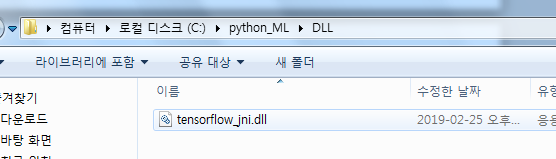

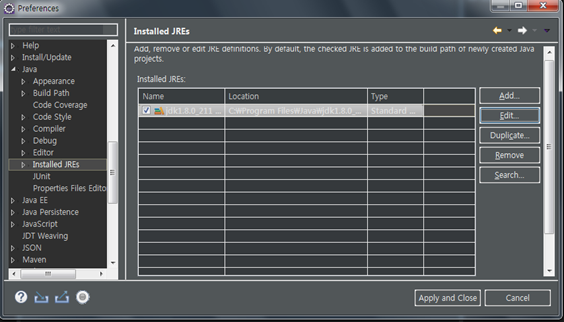

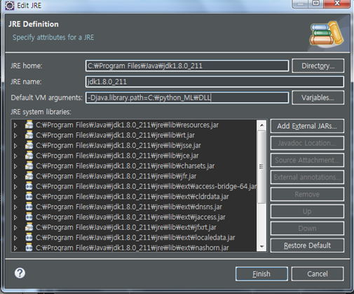

톰캣 7버전설치

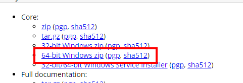

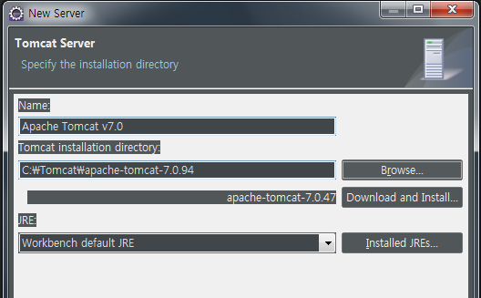

서버설치설정 끝

프로젝트 만들기 - 다이나믹 웹 프로젝트로!

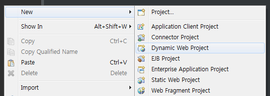

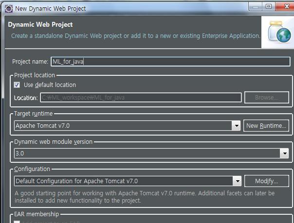

나머지 설정 default값으로

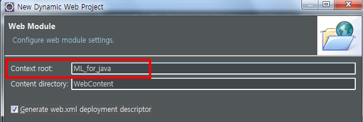

**Context root** : 클라이언트에 의해 프로젝트를 찾고, 명시 하기 위한 이름(한글,영문자,대소문자구분)

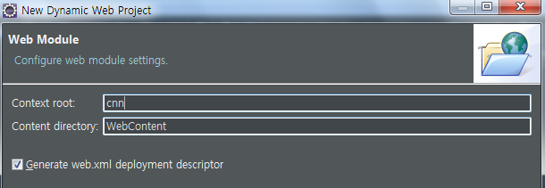

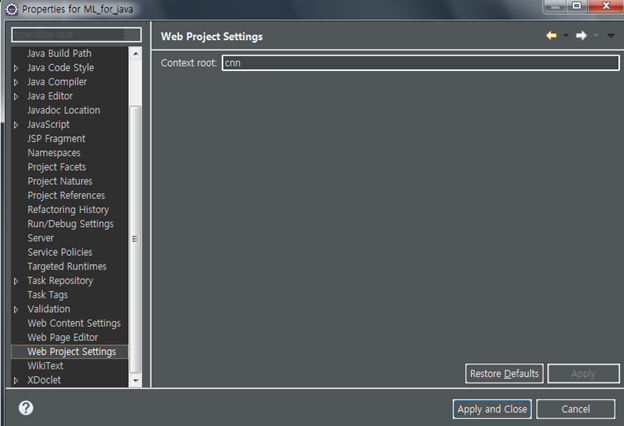

여기서 변경가능함

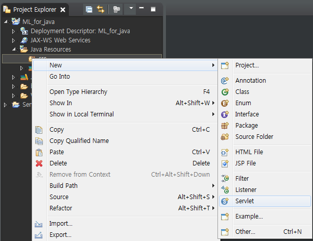

서블릿 자바 클래스 생성

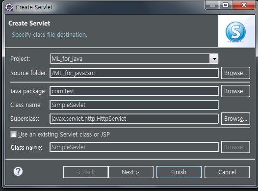

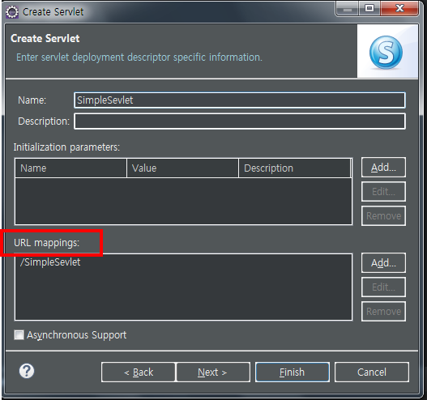

**url mapping** : Web상에서 java program(servlet)을 지칭하기 위한 논리적인 이름

=> SimpleServlet 을 /sample로 바꾸고 넥스트누르고 finish

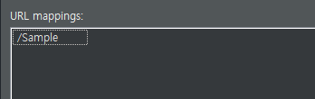

Life cycle

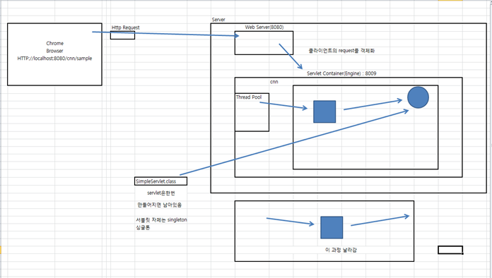

HTML 파일 만들기 

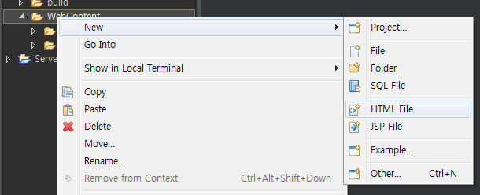

- jQuery cnd

https://code.jquery.com/

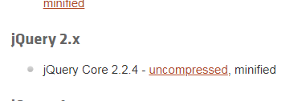

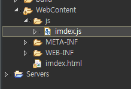

index.js 만듬 , 파일명 오타나서 수정했음!

